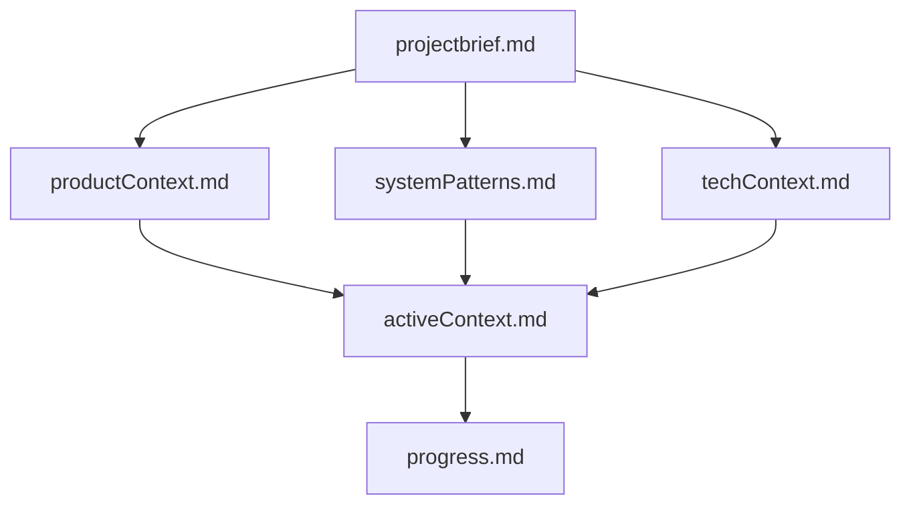

# Memory Bank

This directory contains the Memory Bank for the Blockchain Transaction Visualizer project. The Memory Bank is a comprehensive documentation system that maintains context between sessions, ensuring continuity and consistency in development.

## Purpose

The Memory Bank serves as the primary knowledge repository for the project. It contains detailed information about:

- Project requirements and goals
- System architecture and design patterns
- Technical context and implementation details
- Current development status and progress
- Active work and future plans

## Structure

The Memory Bank follows a hierarchical structure where files build upon each other:

### Core Files

1. **projectbrief.md**
   - Foundation document that shapes all other files
   - Defines core requirements and goals
   - Source of truth for project scope

2. **productContext.md**
   - Why this project exists
   - Problems it solves
   - How it should work
   - User experience goals

3. **activeContext.md**
   - Current work focus
   - Recent changes
   - Next steps
   - Active decisions and considerations

4. **systemPatterns.md**
   - System architecture
   - Key technical decisions
   - Design patterns in use
   - Component relationships

5. **techContext.md**
   - Technologies used
   - Development setup
   - Technical constraints
   - Dependencies

6. **progress.md**
   - What works
   - What's left to build
   - Current status
   - Known issues

7. **.clinerules**
   - Project intelligence
   - Critical implementation paths
   - User preferences and workflow
   - Project-specific patterns
   - Known challenges
   - Tool usage patterns

## Usage

The Memory Bank should be consulted at the beginning of each development session to understand the current state of the project and the context for ongoing work. It should be updated whenever:

1. New project patterns are discovered
2. Significant changes are implemented
3. Context needs clarification
4. Project status changes

## Maintenance

The Memory Bank is a living documentation system that evolves with the project. Regular updates ensure that it remains an accurate and valuable resource for all project contributors.
