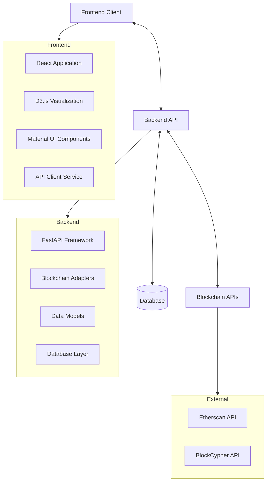
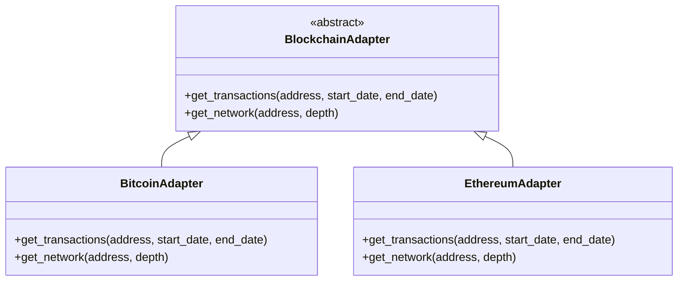
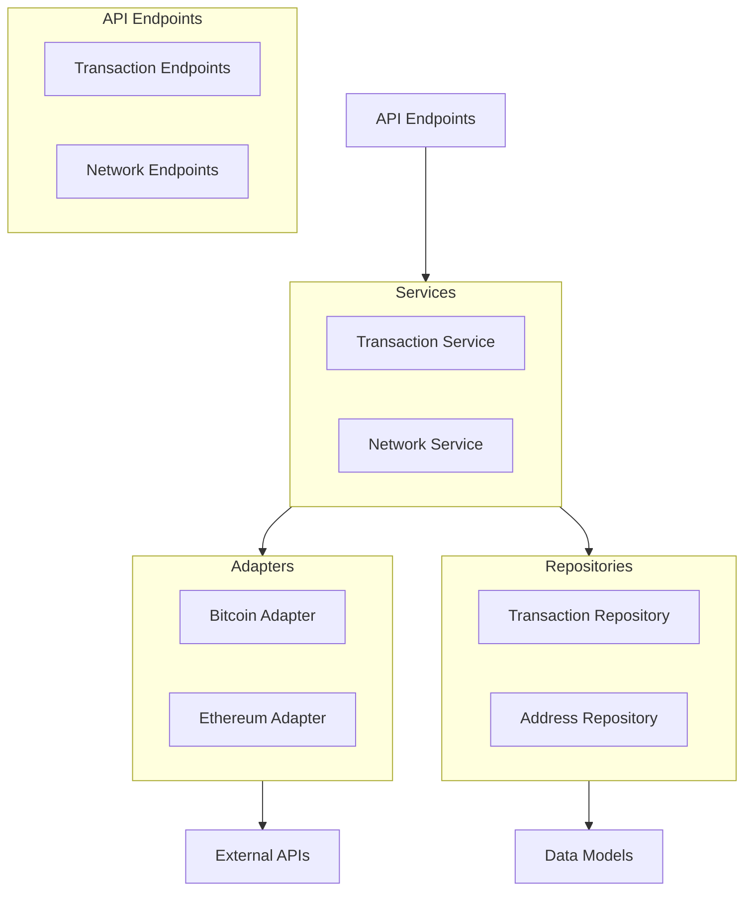
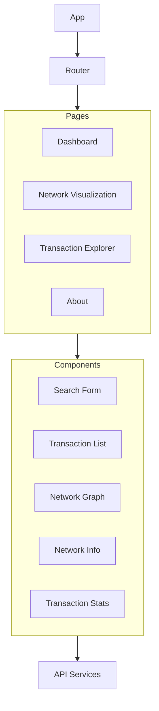
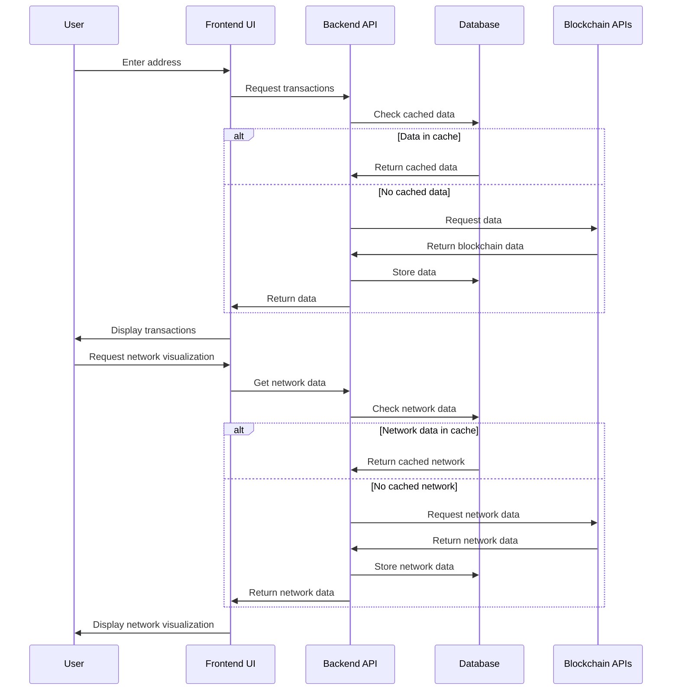

# Blockchain Transaction Visualizer - System Patterns

## System Architecture

The Blockchain Transaction Visualizer follows a modern client-server architecture with clear separation of concerns:

## Key Technical Decisions

### 1. Containerized Deployment
- **Decision**: Use Docker and Docker Compose for deployment
- **Rationale**: Ensures consistent environment across development and production, simplifies setup process
- **Implementation**: Separate Dockerfiles for frontend and backend, orchestrated with docker-compose.yml

### 2. API Abstraction Layer
- **Decision**: Create blockchain-specific adapters that implement a common interface
- **Rationale**: Allows for consistent handling of different blockchain data sources
- **Implementation**: Base classes with blockchain-specific implementations (Bitcoin, Ethereum)

### 3. Database Caching
- **Decision**: Store retrieved blockchain data in a local database
- **Rationale**: Reduces API calls, improves performance, handles rate limits
- **Implementation**: SQLAlchemy ORM with PostgreSQL

### 4. Depth-Based Network Exploration
- **Decision**: Implement configurable "depth" for transaction network exploration
- **Rationale**: Balances between comprehensive data and performance/complexity
- **Implementation**: Recursive API calls with depth limiting

### 5. Frontend Framework
- **Decision**: Use React with Material UI
- **Rationale**: Component-based architecture, rich ecosystem, responsive design
- **Implementation**: Functional components with hooks for state management

### 6. Visualization Library
- **Decision**: Use D3.js for network visualization
- **Rationale**: Powerful, flexible visualization capabilities for complex network graphs
- **Implementation**: Custom D3 integration with React components

## Design Patterns

### 1. Adapter Pattern
- **Usage**: Blockchain API integrations
- **Implementation**: Base blockchain adapter class with specific implementations for each blockchain
- **Benefits**: Consistent interface for different data sources

### 2. Repository Pattern
- **Usage**: Database access
- **Implementation**: Database models and operations encapsulated in repository classes
- **Benefits**: Separation of data access logic from business logic

### 3. Service Pattern
- **Usage**: Business logic implementation
- **Implementation**: Service classes that coordinate between API adapters and repositories
- **Benefits**: Encapsulation of complex operations, reusability

### 4. Component Pattern
- **Usage**: Frontend UI organization
- **Implementation**: Reusable React components (SearchForm, TransactionList, NetworkGraph)
- **Benefits**: Modularity, reusability, maintainability

### 5. Dependency Injection
- **Usage**: Backend service configuration
- **Implementation**: FastAPI dependency injection system
- **Benefits**: Testability, flexibility, configuration management

## Component Relationships

### Backend Components

### Frontend Components

## Data Flow

## Technical Constraints and Considerations

1. **API Rate Limits**
   - Etherscan: 5 calls/second
   - BlockCypher: 3 calls/second and 200 calls/hour
   - Solution: Caching, rate limiting, and request batching

2. **Data Volume**
   - Challenge: Addresses with thousands of transactions
   - Solution: Pagination, filtering, and optimized database queries

3. **Visualization Performance**
   - Challenge: Rendering large network graphs
   - Solution: Limit depth, implement zooming/filtering, use WebGL for rendering

4. **Cross-Browser Compatibility**
   - Challenge: Ensuring consistent visualization across browsers
   - Solution: Browser testing, polyfills, and responsive design
