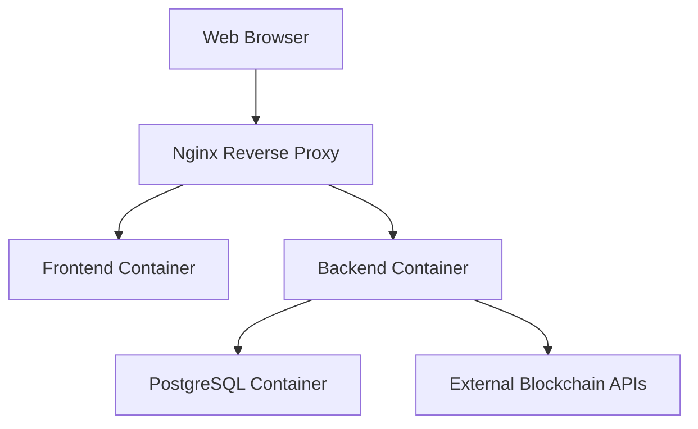

# Blockchain Transaction Visualizer - Technical Context

## Technologies Used

### Backend

| Technology | Version | Purpose |
|------------|---------|---------|
| Python | 3.9+ | Primary backend language |
| FastAPI | 0.68.0+ | API framework |
| SQLAlchemy | 1.4+ | ORM for database interactions |
| Pydantic | 1.8+ | Data validation and settings management |
| PostgreSQL | 13+ | Database for storing transaction data |
| Docker | 20+ | Containerization |
| BlockCypher API | v1 | Bitcoin blockchain data retrieval |
| Etherscan API | v1 | Ethereum blockchain data retrieval |

### Frontend

| Technology | Version | Purpose |
|------------|---------|---------|
| React | 17+ | Frontend framework |
| Material UI | 5+ | UI component library |
| D3.js | 7+ | Data visualization library |
| Axios | 0.21+ | HTTP client for API requests |
| React Router | 6+ | Client-side routing |
| Docker | 20+ | Containerization |

## Development Setup

### Prerequisites

- Docker and Docker Compose
- Node.js and Yarn (for local frontend development)
- Python 3.9+ (for local backend development)
- API keys for BlockCypher and Etherscan

### Environment Configuration

The project uses environment variables for configuration, stored in `.env` files:

```
# API Keys
BLOCKCYPHER_API_KEY=your_blockcypher_api_key_here
ETHERSCAN_API_KEY=your_etherscan_api_key_here

# Database settings
POSTGRES_USER=postgres
POSTGRES_PASSWORD=postgres
POSTGRES_DB=blockchain
```

### Local Development

#### Using Docker Compose

```bash
# Start all services
docker-compose up -d

# View logs
docker-compose logs -f

# Stop all services
docker-compose down
```

#### Backend Development (without Docker)

```bash
cd backend
pip install -r requirements.txt
uvicorn main:app --reload
```

#### Frontend Development (without Docker)

```bash
cd frontend
yarn install
yarn start
```

### API Documentation

FastAPI automatically generates OpenAPI documentation, available at:
- Swagger UI: http://localhost:8000/docs
- ReDoc: http://localhost:8000/redoc

## Technical Constraints

### API Rate Limits

#### BlockCypher API
- 3 requests per second
- 200 requests per hour (free tier)
- Requires API key for higher limits

#### Etherscan API
- 5 calls per second
- 100,000 calls per day (free tier)
- Requires API key

### Database Considerations

- Transaction data can grow large for addresses with many transactions
- Network data requires efficient graph representation in relational database
- Indexes are crucial for performance on address and transaction hash lookups

### Frontend Performance

- Network visualizations can become resource-intensive with large datasets
- D3.js requires careful optimization for complex visualizations
- Mobile devices have limited resources for rendering complex graphs

## Dependencies

### Backend Dependencies

```
fastapi==0.68.0
uvicorn==0.15.0
sqlalchemy==1.4.23
pydantic==1.8.2
psycopg2-binary==2.9.1
requests==2.26.0
python-dotenv==0.19.0
```

### Frontend Dependencies

```json
{
  "dependencies": {
    "@material-ui/core": "^5.0.0",
    "@material-ui/icons": "^5.0.0",
    "axios": "^0.21.1",
    "d3": "^7.0.0",
    "react": "^17.0.2",
    "react-dom": "^17.0.2",
    "react-router-dom": "^6.0.0",
    "react-scripts": "4.0.3"
  }
}
```

## Development Workflow

1. **Feature Planning**: Define feature requirements and technical approach
2. **Backend Development**: Implement API endpoints and data processing
3. **Frontend Development**: Create UI components and integrate with backend
4. **Testing**: Manual testing of features and API endpoints
5. **Deployment**: Build and deploy using Docker Compose

## Deployment Architecture



## Security Considerations

1. **API Keys**: Stored as environment variables, never exposed to frontend
2. **CORS**: Configured to allow only specific origins
3. **Rate Limiting**: Implemented to prevent abuse of backend API
4. **Input Validation**: All user inputs validated using Pydantic schemas
5. **Error Handling**: Structured error responses without exposing internal details

## Monitoring and Logging

- Backend logs API requests and errors
- Docker logs captured for all containers
- API rate limit tracking to prevent exceeding external API limits

## Future Technical Considerations

1. **Scaling**: Horizontal scaling for backend API if user base grows
2. **Caching**: Redis caching layer for frequently accessed data
3. **Authentication**: User accounts for saving searches and custom visualizations
4. **Additional Blockchains**: Support for more blockchain networks
5. **Advanced Analytics**: Machine learning for pattern detection in transaction data
