# ブロックチェーン可視化ツールのリポジトリ構造

このドキュメントでは、ブロックチェーン可視化ツールのリポジトリ構造を図示します。

## ディレクトリ構造図

```mermaid
graph TD
    Root[my-blockchain-visualizer] --> Backend[backend/]
    Root --> Frontend[frontend/]
    Root --> Notebooks[notebooks/]
    Root --> MemoryBank[memory_bank/]
    Root --> Src[src/]
    Root --> ConfigFiles[設定ファイル]
    
    Backend --> BackendMain[main.py]
    Backend --> BackendDockerfile[Dockerfile]
    Backend --> BackendRequirements[requirements.txt]
    Backend --> BackendDeleteTx[delete_transactions.py]
    Backend --> BackendApp[app/]
    
    BackendApp --> AppInit[__init__.py]
    BackendApp --> AppSchemas[schemas.py]
    BackendApp --> AppApi[api/]
    BackendApp --> AppBlockchain[blockchain/]
    BackendApp --> AppDatabase[database/]
    
    AppApi --> ApiInit[__init__.py]
    AppApi --> ApiBase[base.py]
    AppApi --> ApiBlockcypher[blockcypher.py]
    AppApi --> ApiEtherscan[etherscan.py]
    
    AppBlockchain --> BlockchainInit[__init__.py]
    AppBlockchain --> BlockchainBase[base.py]
    AppBlockchain --> BlockchainBitcoin[bitcoin.py]
    AppBlockchain --> BlockchainEthereum[ethereum.py]
    
    AppDatabase --> DatabaseInit[__init__.py]
    AppDatabase --> DatabaseDB[database.py]
    AppDatabase --> DatabaseModels[models.py]
    AppDatabase --> DatabaseReset[reset_database.py]
    
    Frontend --> FrontendDockerfile[Dockerfile]
    Frontend --> FrontendPackage[package.json]
    Frontend --> FrontendYarn[yarn.lock]
    Frontend --> FrontendPublic[public/]
    Frontend --> FrontendSrc[src/]
    
    FrontendPublic --> PublicIndex[index.html]
    FrontendPublic --> PublicManifest[manifest.json]
    
    FrontendSrc --> SrcApp[App.js]
    FrontendSrc --> SrcIndex[index.js]
    FrontendSrc --> SrcIndexCSS[index.css]
    FrontendSrc --> SrcWebVitals[reportWebVitals.js]
    FrontendSrc --> SrcComponents[components/]
    FrontendSrc --> SrcPages[pages/]
    FrontendSrc --> SrcServices[services/]
    
    SrcComponents --> ComponentsHeader[Header.js]
    SrcComponents --> ComponentsNetworkGraph[NetworkGraph.js]
    SrcComponents --> ComponentsNetworkInfo[NetworkInfo.js]
    SrcComponents --> ComponentsSearchForm[SearchForm.js]
    SrcComponents --> ComponentsTxList[TransactionList.js]
    SrcComponents --> ComponentsTxSearchForm[TransactionSearchForm.js]
    SrcComponents --> ComponentsTxStats[TransactionStats.js]
    
    SrcPages --> PagesAbout[About.js]
    SrcPages --> PagesDashboard[Dashboard.js]
    SrcPages --> PagesNetworkVis[NetworkVisualization.js]
    SrcPages --> PagesTxExplorer[TransactionExploler.js]
    
    SrcServices --> ServicesApi[api.js]
    
    Notebooks --> NotebooksBlockcypher[blockcypher_api.ipynb]
    Notebooks --> NotebooksPipfile[Pipfile]
    Notebooks --> NotebooksPipfileLock[Pipfile.lock]
    
    MemoryBank --> MemoryVSCode[vscode_insiders_code_command.md]
    
    ConfigFiles --> GitIgnore[.gitignore]
    ConfigFiles --> DockerCompose[docker-compose.yml]
    ConfigFiles --> Pipfile[Pipfile]
    ConfigFiles --> PipfileLock[Pipfile.lock]
    ConfigFiles --> ReadMe[README.md]
```

## 主要コンポーネント説明

### バックエンド (`backend/`)
- Python FastAPIを使用したバックエンドサーバー
- ブロックチェーンAPI（BlockcypherとEtherscan）との連携
- ビットコインとイーサリアムのブロックチェーンデータ処理
- データベース操作とモデル定義

### フロントエンド (`frontend/`)
- Reactベースのフロントエンドアプリケーション
- ネットワークグラフ可視化コンポーネント
- トランザクション検索と表示機能
- ダッシュボードとネットワーク可視化ページ

### ノートブック (`notebooks/`)
- Jupyter notebookによるAPI検証と実験

### その他
- Docker設定（Dockerfile、docker-compose.yml）
- 依存関係管理（Pipfile、package.json）
